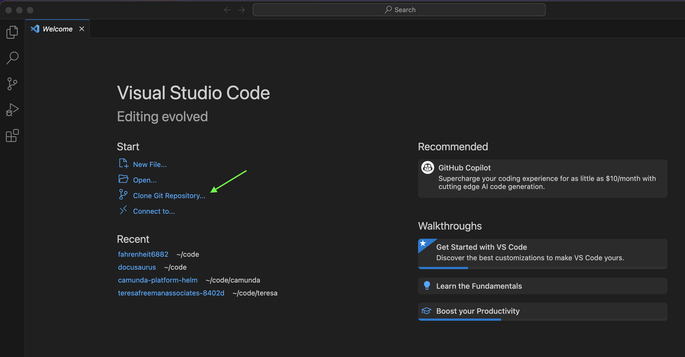

# First Robotics Fahrenheit Team Website

Welcome Students and Mentors! 

What you are looking at right now is a `README.md` text file that exists inside our Team's [Git Repository](https://git-scm.com/book/en/v2/Git-Basics-Getting-a-Git-Repository). 

This repository is the source of our website which is available to everyone on the internet at this url: 

[https://fahrenheitrobotics.org](https://fahrenheitrobotics.org)

There are 2 ways to make changes the site. Setting up your computer with VS Code is recommended. Quick changes are also possible from your web browser in Github. See the sections below for more details. 

# How the site is organized

The [index.html](index.html) file at the root of this repository is what is displayed in your browser when you browse to [https://fahrenheitrobotics.org](https://fahrenheitrobotics.org)

So far, that's it! All we have now is just a single [index.html](index.html) page. 

Later, we can add more `html` pages as needed and either link to them from [index.html](index.html), or create subfolders that will appear as paths in our url. 

# How Setup your Computer to Edit the Site

## Download and install VS Code

All the files in this repository are simple text files. You can use any text editor program you want to change these files. But, we suggest you use VS Code, which is a editor program built specficially to edit source code text files. 

Learn how to Download and Install VS Code here: 

https://code.visualstudio.com/docs/introvideos/basics

## Download files using VS Code and git

Once you have VS Code installed, you will need to download the files you see here to your computer and then open the files inside your editor.

We can click on each file and click download, but that is tedious and it will also be difficult to know if someone else has changed a file since we downloaded our copy. 

There's a program called [git](https://git-scm.com/) that was invented to help people edit text files together. 

When you download all files from a github repository to your own computer using `git`, that's called `cloning` a repository. 

> [!NOTE]  
> `git` is an example of a Source Control Manager. There are other source controls managers as well, such as [subversion](https://subversion.apache.org/) and [perforce](https://www.perforce.com/). But, these days, `git` is, by far!, the most popular. 

It's possible to use `git` by itself (outside of VS Code), but we can also use `git` right from inside VS Code which is a little easier. 

The first time you open VS Code, you'll see a page like the image below. Click on `Clone Git Repository` as shown here: 



> [!NOTE]  
> In 2008, a group of people thought it would be cool if they could share their `git` repositories online and so they created `Github`. There is another popular site for sharing git repositories called [Gitlab](https://about.gitlab.com/)

There are many repositories on github. Here's the url for our team's website's `git repository`:

[https://github.com/Fahrenheit6882/Fahrenheit6882.github.io.git](https://github.com/Fahrenheit6882/Fahrenheit6882.github.io.git)

Copy and paste that link into VS Code like this: 


> [!NOTE]  
> Our Github Repository is private. Please let a mentor know if you need access. 

The next step is to choose which folder on your computer to download the files into. I created a folder named `website`. You can create whatever folder that you want. After you create and choose the folder where you want to save the files, click `Select as Repository Destination`. 

Click the buttons to say that you trust this code, and that's it! You now have the code for our website open in VS Code. 

# How to make quick changes from your browser

If needed, it's possible to make quick changes directly from your browser on github.

> [!WARNING]  
> It's easy to break the website using this technique. It's much better to test changes in VS Code on your own computer first before publishing to the live site. Making quick changes as described below should only be done for small spelling or style fixes, or when it's very inconvenient to use VS Code. 

Click to open any files in github and then click the pencil icon to make changes. When finished, click the `Commit Changes` button. 

For example, click to open [index.html](https://github.com/Fahrenheit6882/Fahrenheit6882.github.io/blob/main/index.html) in your browser, and then click the pencil icon in the upper left to [edit the file in place](https://github.com/Fahrenheit6882/Fahrenheit6882.github.io/edit/main/index.html). Make your changes and click `Commit Changes...` 

After a few minutes, your changes will be live.  

# How the Website is built

The source code files that produce our website are made of `html`, `css`, and `js` files. 

When you edit the files in VS Code installed on your computer, only you can see the changes that you've made. 

When you're happy with the changes, you will need to upload the changed files back to github. 

> [!NOTE]  
> When you use `git` to upload changed files, the command that is run is called `git push`. So, you will often hear developers talk about `pushing` their code to github. 

Whenever new or changed files are pushed to github, then the "Live" site available here will show the changes: 

[https://fahrenheitrobotics.org](https://fahrenheitrobotics.org)

The website is made up of 3 main types of files: 

## HTML 
`html` files are text files that contain html source code. These text files end in `.html` and contain source code that must match the html syntax [defined here](https://www.w3.org/TR/2011/WD-html5-20110405/). 

HTML uses `tags` that look like the following. Here's an example of a Heading (`<h1>`) and a Paragraph (`<p>`) tag looks like in an `html` file: 

```html
<h1>This is a Heading</h1>
<p>And this is a paragraph</p>
```

Here's a tutorial to learn about HTML: https://www.w3schools.com/html/default.asp

## CSS (Cascading Style Sheets)

`css` files are text files that contain css source code. These text files end in `.css` and contain source code that must match the css syntax [defined here](https://www.w3.org/TR/CSS2/) 

CSS is used to control what the html should look like. For example, we could change the way the HTML looks above using the following `css`. In this example, we set the background color of the Heading to `red`, and we change the font size of the paragraph to `20px`: 

```css
h1 {
    background-color: red;
}

p {
    font-size: 20px; 
}
```

Here's a tutorial to learn about CSS: https://www.w3schools.com/css/default.asp

## Javascript (js) Files

We're not using javascript yet, but I think we'll need it soon, and it's really fun ;-) 

Here's a tutorial to learn about Javascript: 
https://www.w3schools.com/js/default.asp

## Git

Here's a tutorial to learn about Git: 
https://www.w3schools.com/git/default.asp
