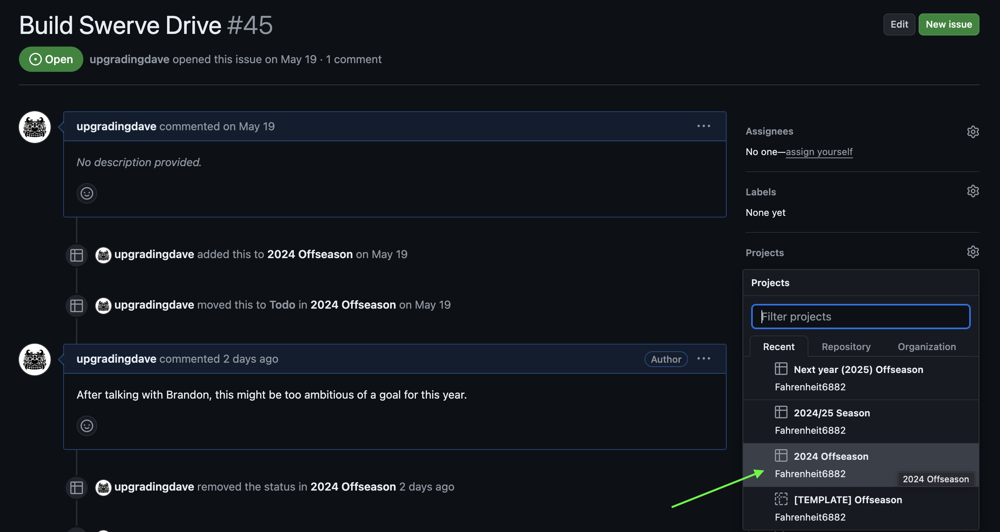
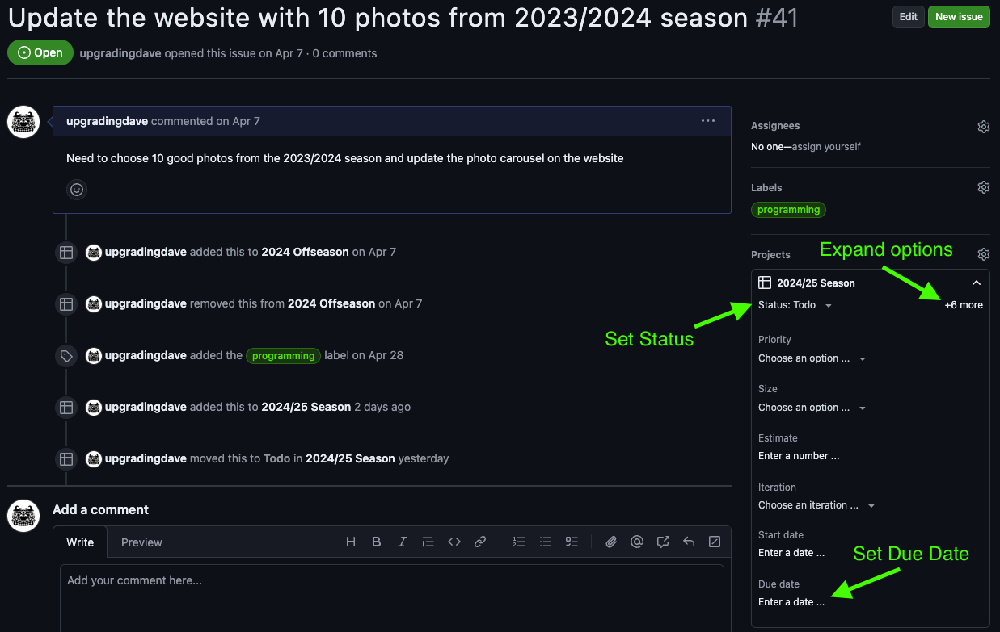
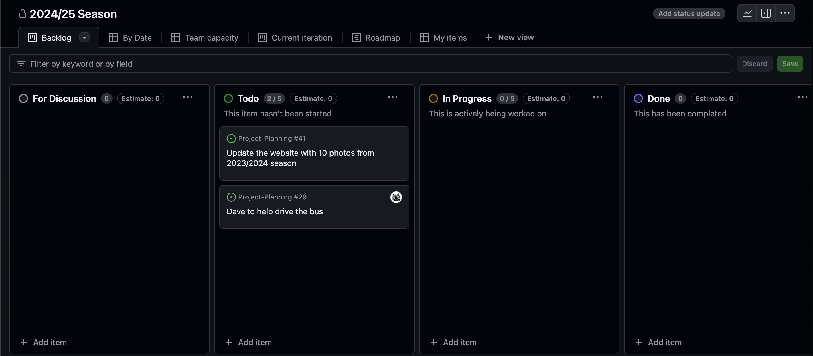

export const MyButton = ({children}) => (
  <a
    href="https://github.com/orgs/Fahrenheit6882/projects"
    class="button button--primary">
    {children}
  </a>
);

# Projects

Tasks can be organized into Projects. 

For example, we used a project named [2024 Offseason](https://github.com/orgs/Fahrenheit6882/projects/1) to manage tasks that we wanted to accomplish during the 2024 Offseason. 

<MyButton>View Projects</MyButton>
&nbsp;

To add a task to a project, navigate to [Issues list](https://github.com/Fahrenheit6882/Project-Planning/issues) and click on the issue that you'd like to add. You will see a section called `Projects` on the right sidebar. Click on the gear icon and select the Project. 

After a task has been added to a project, you can update the status and due date: 

Click on the Project Name to navigate to see the `Project view`. This view shows all tasks that have been added to the project and the status of each task. 

