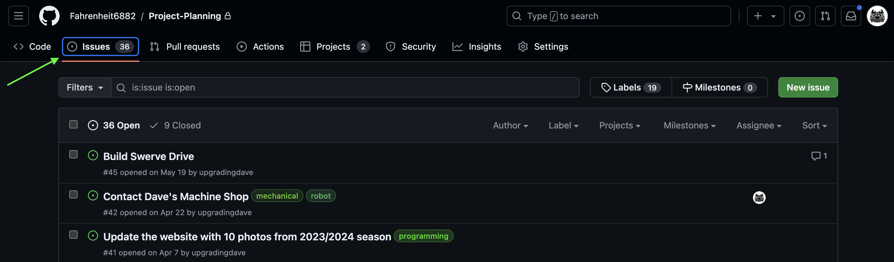

export const MyButton = ({children}) => (
  <a
    href="https://github.com/Fahrenheit6882/Project-Planning/issues/new"
    class="button button--primary">
    {children}
  </a>
);

# Tasks

Anytime you think of something cool that the Team should work on, that's a task. For example: 

> "I think we should build a shooter!"

> "We need a more noodles for bumpers"

> "Let's organize a trip to funland"

> "I think we should get a chocolate fountain for the open house!"

These are all tasks :-) 

Whenever you have an idea for a task, add it to our [Project Planning Repo](https://github.com/Fahrenheit6882/Project-Planning). 

To add a new task, Or just click here

<MyButton>Create New Task</MyButton>
&nbsp;

Or, navigate to our [Project Planning Repo](https://github.com/Fahrenheit6882/Project-Planning) repo and then click on [Issues](https://github.com/Fahrenheit6882/Project-Planning/issues) tab. Then click on the green button labeled [New Issue](https://github.com/Fahrenheit6882/Project-Planning/issues/new). 

