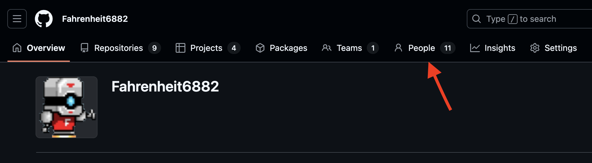

# Version Control

Version Control is a strategy to help multiple people collaborate and edit the same files and track changes to files over time. [Here's an overview about Version Control](https://www.atlassian.com/git/tutorials/what-is-version-control)

`git` is an example of a Source Version Control Manager. There are other source controls managers as well, such as [subversion](https://subversion.apache.org/) and [perforce](https://www.perforce.com/). But, these days, `git` is the most popular. 

# Git

[Git](https://git-scm.com/) is a version control program that was invented to help people edit text files together. 

[Here's a tutorial about Git](https://www.w3schools.com/git/default.asp) 

### How to install Git

Go to [the git download page here](https://git-scm.com/downloads) and download the installation for your operating system.

After you install Git, you should check to make sure it works. If you're on Mac, open a terminal. If you're on Windows, search for a program called `git bash` and run that to start a terminal. Then try typing `git --help` and press enter. If `git` is installed, you should see something similar to the following:  

```shell
$ git --version
git version 2.47.0.windows.2
```

### Configure Git

Before using `git` to track your code, you need to tell it your email and username. 

```shell
git config --global user.email "you@example.com"
git config --global user.name "Your Name"
```
# Github

:::info
What exactly is Github? In 2008, a group of people thought it would be cool if they could share their `git` repositories online and so they created `Github`. 
But it's not necessary to use Github to use git. [This guide here](https://git-scm.com/book/en/v2/Git-on-the-Server-The-Protocols) describes how to host your own git server and collaborate with your friends and teamates. 
There are also other popular sites for sharing git repositories such as [Gitlab](https://about.gitlab.com/) and [Bitbucket](https://bitbucket.org/)
:::

### Github Organization

[Fahrenheit6882](https://github.com/Fahrenheit6882) is our Team's Github Organization. It includes code repositories and Projects. 

Some of the issue lists and projects inside the organization are private. In order to get access, you need a github account. 
Once you have a github account and are able to successfully sign in, one of the mentors can grant you access by following these steps:

1. Navigate to this page: https://github.com/Fahrenheit6882
2. Click `People` menu
3. Click `Invite member`, search and add the new member by github username and/or email address



### Configure a ssh key for Github

If you would like to push code to github, it will require you to setup a SSH Key.

[Follow this guide](https://docs.github.com/en/authentication/connecting-to-github-with-ssh/generating-a-new-ssh-key-and-adding-it-to-the-ssh-agent) to setup a ssh key for git
