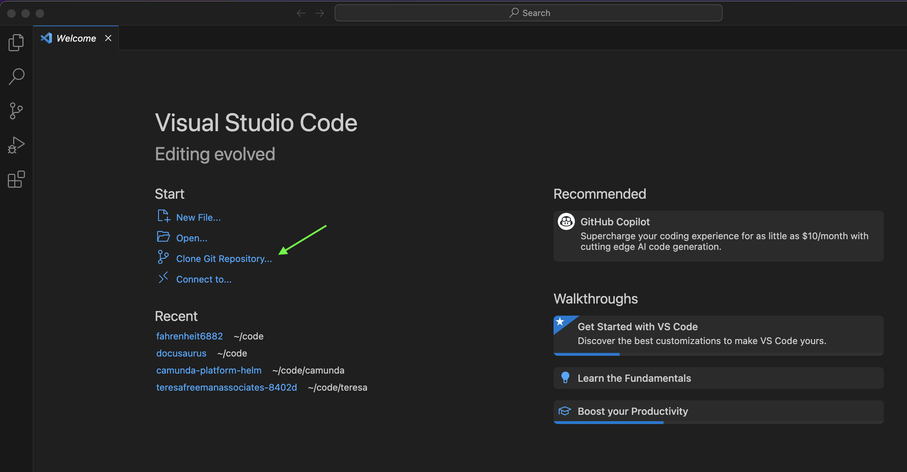
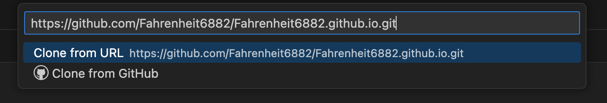

# How to setup your Laptop

You'll need to install and setup the following software before you can make changes to the Website. 

## Download and install VS Code

All the files in this repository are simple text files. You can use any text editor program you want to change these files. But, we suggest you use VS Code, which is a editor program built specficially to edit source code text files. 

[See our Guide to setup VS Code here](../software/vscode.mdx)

## Download files using VS Code and git

Once you have VS Code installed, the next step is to download this website's source code files your computer and then open these files inside your editor.

When you download all files from a github repository to your own computer using `git`, that's called `cloning` a repository. 

It's possible to use `git` by itself (outside of VS Code), but we can also use `git` right from inside VS Code which is a little easier. 

The first time you open VS Code, you'll see a page like the image below. Click on `Clone Git Repository` as shown here: 

There are many repositories on github. Here's the url for our team's website's `git repository`:

[https://github.com/Fahrenheit6882/Fahrenheit6882.github.io.git](https://github.com/Fahrenheit6882/Fahrenheit6882.github.io.git)

Copy and paste that link into VS Code like this: 

:::note  
Our Github Repository is private. Please let a mentor know if you need access. 
:::

The next step is to choose which folder on your computer to download the files into. I created a folder named `website`. You can create whatever folder that you want. After you create and choose the folder where you want to save the files, click `Select as Repository Destination`. 

Click the buttons to say that you trust this code, and that's it! You now have the code for our website open in VS Code. 

## Setup Node.js

We use a software library called [docusaurus](https://docusaurus.io/) to help build our site. `docusaurus` is written in a programming language called `javascript`. 

[Follow this guide here](../software/javascript.mdx) to setup your computer to run javascript. 