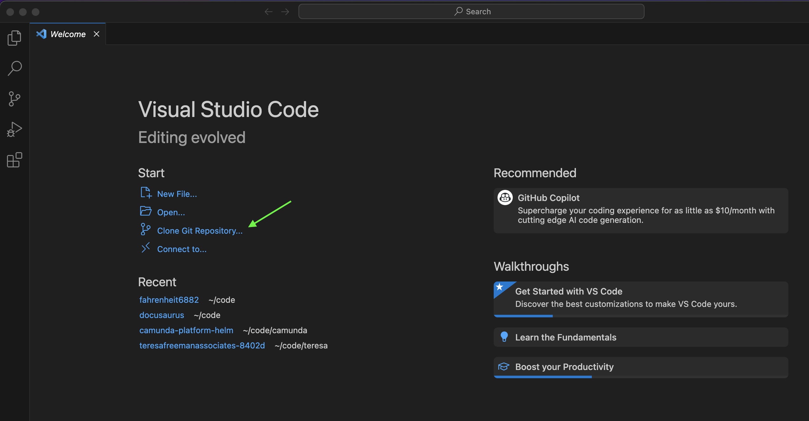

# How to make changes

## Download and install VS Code

All the files in this repository are simple text files. You can use any text editor program you want to change these files. But, we suggest you use VS Code, which is a editor program built specficially to edit source code text files. 

Learn how to Download and Install VS Code here: 

https://code.visualstudio.com/docs/introvideos/basics

## Download files using VS Code and git

Once you have VS Code installed, you will need to download the files you see here to your computer and then open the files inside your editor.

We can click on each file and click download, but that is tedious and it will also be difficult to know if someone else has changed a file since we downloaded our copy. 

There's a program called [git](https://git-scm.com/) that was invented to help people edit text files together. 

When you download all files from a github repository to your own computer using `git`, that's called `cloning` a repository. 

:::note
`git` is an example of a Source Control Manager. There are other source controls managers as well, such as [subversion](https://subversion.apache.org/) and [perforce](https://www.perforce.com/). But, these days, `git` is the most popular. 
:::

It's possible to use `git` by itself (outside of VS Code), but we can also use `git` right from inside VS Code which is a little easier. 

The first time you open VS Code, you'll see a page like the image below. Click on `Clone Git Repository` as shown here: 

:::note
In 2008, a group of people thought it would be cool if they could share their `git` repositories online and so they created `Github`. There is another popular site for sharing git repositories called [Gitlab](https://about.gitlab.com/)
:::

There are many repositories on github. Here's the url for our team's website's `git repository`:

[https://github.com/Fahrenheit6882/Fahrenheit6882.github.io.git](https://github.com/Fahrenheit6882/Fahrenheit6882.github.io.git)

Copy and paste that link into VS Code like this: 

:::note  
Our Github Repository is private. Please let a mentor know if you need access. 
:::

The next step is to choose which folder on your computer to download the files into. I created a folder named `website`. You can create whatever folder that you want. After you create and choose the folder where you want to save the files, click `Select as Repository Destination`. 

Click the buttons to say that you trust this code, and that's it! You now have the code for our website open in VS Code. 

## How to make changes

Make sure that you are viewing the `docusaurus` git branch. 

Edit `index.html` to change the Homepage. 

Or, edit any of the files under the `site` directory to and and update the Guides and Blogs. 

For example, you could add a whole new guide by creating a new folder under the `site/docs` folder. And then add some markdown files under the new folder. See the `site/docs/website` folder for a sample. 

After you've made your changes, read [this page](/site/docs/website/website-deploy) to learn how you can view the new site on your laptop before pushing it up to the live site. 

## Make quick changes from your browser

If needed, it's possible to make quick changes directly from your browser on github.

:::warning
It's easy to break the website using this technique. It's much better to test changes in VS Code on your own computer first before publishing to the live site. Making quick changes as described below should only be done for small spelling or style fixes, or when it's very inconvenient to use VS Code. 
:::

The files in the `main` branch are what are displayed on the public website. Click to open any files in the `main` branch and then click the pencil icon to make changes. When finished, click the `Commit Changes` button. 

:::warning
Any changes you make will be overwritten the next time we deploy the site. So make sure to also make your changes to the `docusaurus` branch. 
:::

For example, click to open [index.html](https://github.com/Fahrenheit6882/Fahrenheit6882.github.io/blob/main/index.html) in your browser, and then click the pencil icon in the upper left to [edit the file in place](https://github.com/Fahrenheit6882/Fahrenheit6882.github.io/edit/main/index.html). Make your changes and click `Commit Changes...` 

After a few minutes, your changes will be live.  