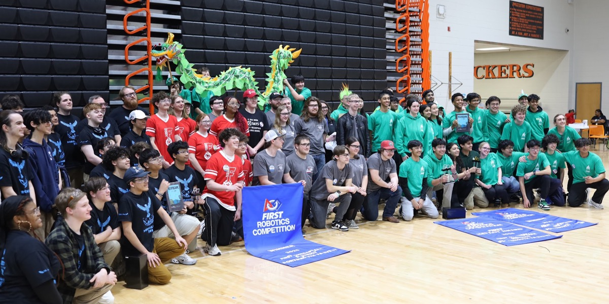
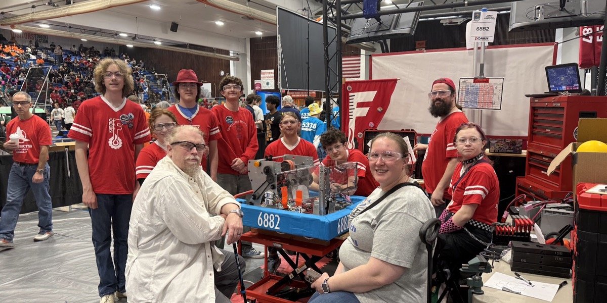

# Fahrenheit Robotics Team Guides

Welcome Students and Mentors!

This is a place where we share guides about how we run our Team and also about the research that we've done to build our Robot. Click on the sidebar to learn more about various topics. 

## Interested in Learning More or Joining?

For anyone interested in learning more about the team or interested in joining, here's a little more about our team and FIRST® Robotics.

### About Fahrenheit Robotics — Team 6882

Fahrenheit Robotics, Team 6882, was founded in 2017 and competes in the [FIRST® Robotics Competition (FRC)](https://www.firstinspires.org/robotics/frc/game-and-season) as part of the FIRST® Chesapeake district — one of over 100 teams competing across the DC, Maryland, and Virginia region. We welcome public, private, and homeschooled students in grades 9-12 (8th graders considered case-by-case) from Fredericksburg, Virginia and the surrounding area.

Every year, our students design, build, and program a ~125-pound robot completely from scratch to compete in that season's new game challenge. The year breaks down into four seasons:

- **Pre-Season (September - December)** — welcoming new members, fundraising, and preparing for optional off-season events.
- **Build Season (January - February)** — kicks off with FIRST®'s live game reveal the first Saturday after New Year's Day, followed by six intense weeks of designing, prototyping, and building the robot.
- **Competition Season (March - April)** — we compete in district qualifying events (Friday evening through Sunday), with top teams advancing to district championships and, for the very best, the FIRST® World Championship.
- **Off-Season (May - August)** — reflecting on the past season, fundraising, and recruiting and training new members for next year.

You don't need to already know robotics to join — there's a role for every interest:

- **Mechanical, Electrical, and Software** engineering — design, wire, and program the robot itself
- **Business & Management** — budgeting, sponsorships, grants, and scheduling
- **Publicity & Brand Management** — social media, the team website, T-shirts, and community outreach
- **Scouting & Mathematics** — collecting and analyzing match data to plan strategy
- **Historian** — photography, video, and documenting the team's story

Above all, we build more than robots — we build STEM skills, leadership, and *Gracious Professionalism®*: FIRST's philosophy of competing fiercely while treating everyone with respect and kindness.

Check out our match history and rankings on [The Blue Alliance](https://www.thebluealliance.com/team/6882), or reach out — we'd love to have you join us. Find us on [Discord](https://discord.com/channels/505146464037634050), [Facebook](https://www.facebook.com/fahrenheitrobotics), or by [email](mailto:fahrenheitrobotics@gmail.com).

